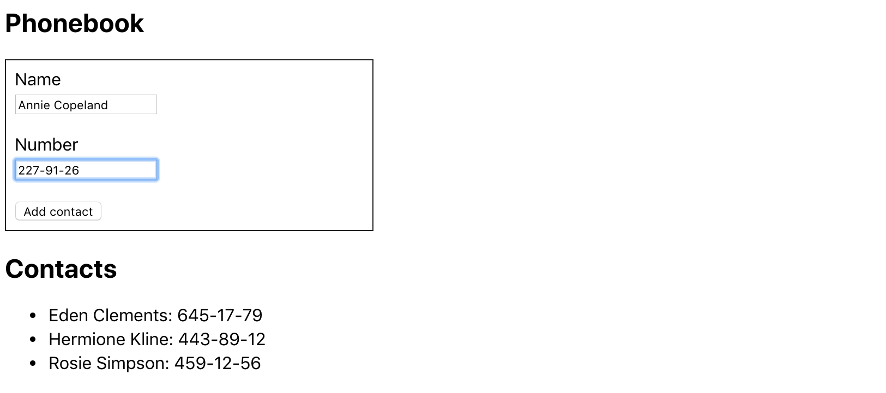

#  goit-react-hw-02-phonebook

Part two of two of the homework for React events, state and forms topics.

Part one ("**goit-react-hw-02-feedback**") of this homework may be found [here](https://github.com/oleksandr-romashko/goit-react-hw-02-feedback).

## Live page

The live page for this repository can be viewed at [GitHub Pages](https://oleksandr-romashko.github.io/goit-react-hw-02-phonebook/).

## Local build and run

  1. Make sure you have an LTS version of Node.js installed on your computer. [Download and install](https://nodejs.org/en/) if needed.
  1. Install the project's base dependencies with the `npm install` command.
  1. Start development mode by running the `npm start` command.
  2. Go to [localhost:3000](http://localhost:3000/) in your browser. This page will automatically reload after saving changes to the project files.

## Tasks Acceptance Criteria

[React project template](https://github.com/goitacademy/react-homework-template/blob/main/README.en.md) is used as a starting point for your application (more information about how to start-up with such a project may be found at the template repo description or [here in a Readme file](./README.en.md)).

  * The `goit-react-hw-02-phonebook` repository is created.
  * When submitting homework, there are two links: to the source files and the live pages of each assignment on `GitHub Pages'.
  * The repository header has a link to the live page on `GitHub pages`.
  * When visiting the work page (GitHub pages) of the assignment, there are no errors or warnings in the console.
  * There is a separate file for each component in the `src/components` folder.
  * The `propTypes` are described for all components.
  * Everything that a component expects in the form of props is delivered to it when it is called.
  * The JS code is clean and clear, using `Prettier`.
  * Styling is done by CSS modules or Styled Components.

## Task 2 - Contact Book

Write an application to store your phonebook contacts.

### Step 1

The application should consist of a form and a list of contacts. In the current step, implement adding a contact name and displaying a list of contacts. The application should not save contacts between different sessions (page refresh).

Use this input markup with built-in validation for the contact name.

```html
<input
  type="text"
  name="name"
  pattern="^[a-zA-Zа-яА-Я]+(([' -][a-zA-Zа-яА-Я ])?[a-zA-Zа-яА-Я]*)*$"
  title="Name may contain only letters, apostrophe, dash and spaces. For example Adrian, Jacob Mercer, Charles de Batz de Castelmore d'Artagnan."
  required
/>
```

The state held in the parent component `<App>` must necessarily be the following form, you can not add new properties.

```javascript
  state = {
    contacts: [],
    name: ''
  }
```

Each contact must be an object with properties `name` and `id`. To generate identifiers, use any suitable package, e.g. [nanoid](https://www.npmjs.com/package/nanoid).

After completing this step, the application should look something like this.

<p align="left">
  
</p>

### Step 2

Expand the functionality of the app by allowing users to add phone numbers. 
To do this, add `<input type="tel">` to the form, and a property to store its value in the state.

```javascript
state = {
  contacts: [],
  name: '',
  number: ''
}
```

Use this markup of an instance with built-in validation for the contact number.

```html
<input
  type="tel"
  name="number"
  pattern="\+?\d{1,4}?[-.\s]?\(?\d{1,3}?\)?[-.\s]?\d{1,4}[-.\s]?\d{1,4}[-.\s]?\d{1,9}"
  title="Phone number must be digits and can contain spaces, dashes, parentheses and can start with +"
  required
/>
```

After completing this step, the application should look something like this.

<p align="left">
  
</p>

### Step 3

Add a search field that you can use to filter your contact list by name.

  * The search field is a formless intuplet whose value is written to the state (controlled item).
  * The filtering logic should be case insensitive.

```javascript
state = {
  contacts: [],
  filter: '',
  name: '',
  number: ''
}
```

<p align="left">
  
</p>

When we work on new functionality, it can be convenient to hardcode some data into a state. This eliminates the need to manually enter data in the interface to test the new functionality. For example, you can use this initial state.

```javascript
state = {
  contacts: [
    {id: 'id-1', name: 'Rosie Simpson', number: '459-12-56'},
    {id: 'id-2', name: 'Hermione Kline', number: '443-89-12'},
    {id: 'id-3', name: 'Eden Clements', number: '645-17-79'},
    {id: 'id-4', name: 'Annie Copeland', number: '227-91-26'},
  ],
  filter: '',
  name: '',
  number: ''
}
```

### Step 4

If your application is implemented in a single component `<App>`, perform refactoring by separating the appropriate parts into separate components. In the state of the root component `<App>` will leave only the `contacts` and `filter` properties.

```javascript
state = {
  contacts: [],
  filter: ''
}
```

Four components are enough: add contact form, contact list, contact list item, and search filter.

After the refactoring, the root component of the application will look like this.

```html
<div>
  <h1>Phonebook</h1>
  <ContactForm ... />

  <h2>Contacts</h2>
  <Filter ... />
  <ContactList ... />
</div>
```

### Step 5

Deny the user the ability to add contacts whose names are already in the phonebook. If you try to do so, print alert with a warning.

<p align="left">
  
</p>

### Step 6

Extend the functionality of the app by allowing the user to delete previously saved contacts.

<p align="left">
  
</p>